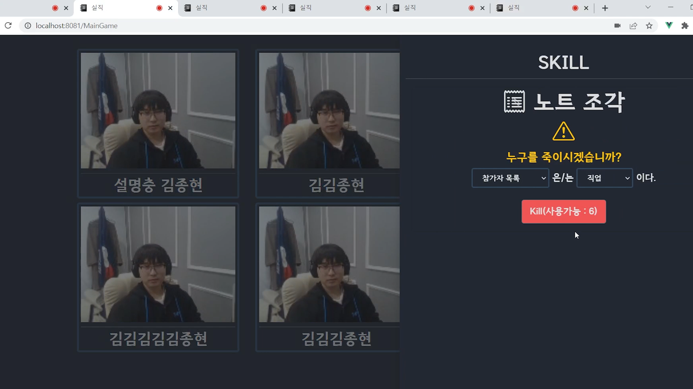
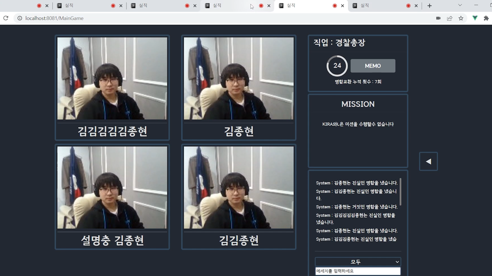
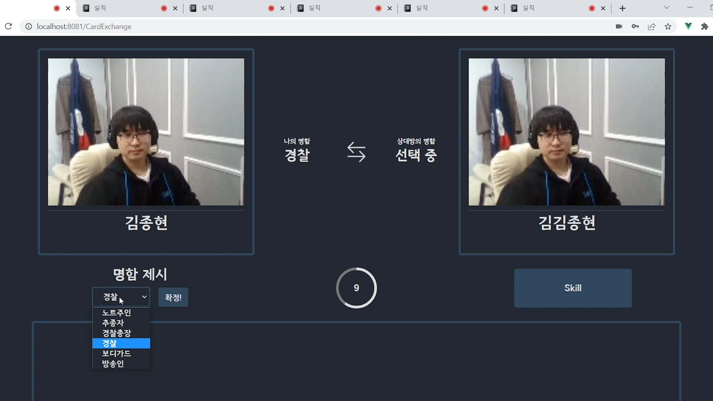
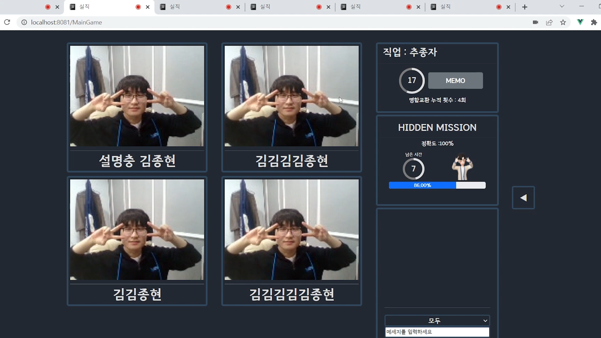

- 

  ##  😎 실례지만 직업과 성함이 어떻게 되십니까?

  WebRTC 기술을 활용한 비대면 마피아 게임

  

  ## 👨‍👩‍👦팀원 소개

  | 순번 | 이름                        | 담당 역할      |
  | ---- | --------------------------- | -------------- |
  | 1    | **강진구(Jin Goo Gang)**    | 팀장, 모션 AI  |
  | 2    | **전창기(Chang Gi Jeon)**   | 부팀장, 백엔드 |
  | 3    | **박우경(Woo Gyeong Park)** | 인프라         |
  | 4    | **김종현(Jong Hyeon Kim)**  | 프론트엔드     |
  | 5    | **윤종목(Jong Mock Yoon)**  | 프론트엔드     |
  | 6    | **이찬희(Chan hee Lee)**    | 프론트엔드, AI |

  

  ## 📽️ 프로젝트 개요

  - **진행 기간**: 2022.01.3 ~ 2022.02.18
  - **프로젝트 소개**
    - 코로나 이후 온라인 비대면 모임이 많아졌습니다. 온라인의 경우 오프라인보다 아이스 브레이킹이 훨씬 어렵습니다. 하지만 컴퓨터를 활용해서 모임이 진행된다는 장점을 살린다면 더 좋은 아이스 브레이킹 도구들을 만들 수 있을 것입니다.
    - 시스템의 도움이 필요한 게임이라고 하면 마피아 게임이 대표적이라고 할 수 있습니다. 어몽어스 등 다양한 종류의 마피아 게임 성공 사례들이 있겠지만 언제나 근본은 얼굴을 마주보고 상대방의 심리를 추리해가면서 진행하는 것이라고 생각합니다.
    - 실직은 데스노트라는 만화의 컨셉을 활용하여 기존 마피아 게임과는 다른 재미를 선사합니다.
  - ⁉️ **용어 정리**
    - 마피아게임
      - 마피아와 시민으로 나뉘어 게임을 시작한다.
      - 서로의 존재를 모르는 상태로 상대의 정체를 추리하고 투표로 한 사람을 죽인다.
      - 마피아는 턴이 끝날 때마다 한 사람을 지목하여 죽일 수 있다.
      - 특정 시민들은 직업을 가지고 있으며 고유 능력을 갖는다.
      - 마피아를 다 검거하면 시민의 승, 시민과 마피아의 수가 같아지면 마피아의 승이다.
    - 데스노트
      - 어느 날 주인공이 데스노트라는 노트를 하나 줍게 된다.
      - 해당 노트에 이름과 사인을 적으면 그 사람은 쓰여진 대로 움직이며 사망한다.
      - 주인공은 이를 이용하여 범죄자들을 스스로 심판한다.
      - 천재 탐정인 L은 이를 정의가 아닌 또 다른 살인으로 평가하고 주인공인 키라를 찾기 위해 치열한 사투를 벌인다.
  - ✏**기획서**
    - [기획안](https://silzick.notion.site/dd91cfac0ec1448a9f1b08f7cd572907)
  - 🎬UCC
    - [실직UCC](https://youtu.be/WVQtWBEhl64)

  

  ## 🎲 게임 진행 방식

  - 노트 주인 측(노트 주인, 추종자)과 경찰측(경찰총장, 보디가드, 방송인, 경찰)로 나뉜다.
  - 일정 시간 경과 후 무작위로 2명이 명함 교환 방으로 이동, 명함 교환을 실시한다.
  - 일정 시간마다 주어지는 미션을 완료한 경우 거짓 명함을 제시할 수 있는 기회를 1회 얻는다.
  - 특정 시간마다 주어지는 히든 미션을 수행하면 고유 스킬 사용 기회를 1회 얻는다.
  - 노트 주인 측에서는 경찰 측의 경찰이 모두 사망 시, 경찰 측은 노트 주인을 체포한 경우 승리한다.

  

  ## Sample UI

  |               **홈 화면**               |               **대기 화면**                |
  | :-------------------------------------: | :----------------------------------------: |
  |      |     |
  |              **스킬 사용**              |              **시스템 채팅**               |
  |  |  |
  |              **명함 교환**              |               **히든 미션**                |
  |  |     |

  
